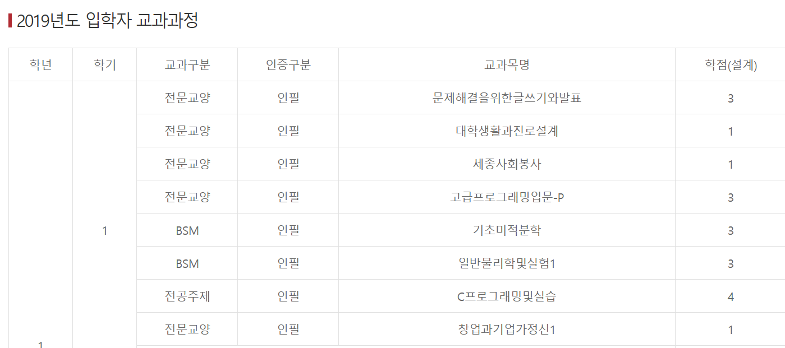
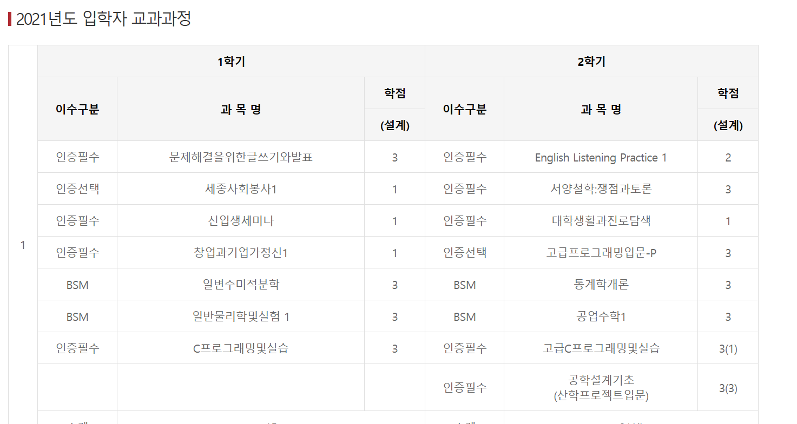
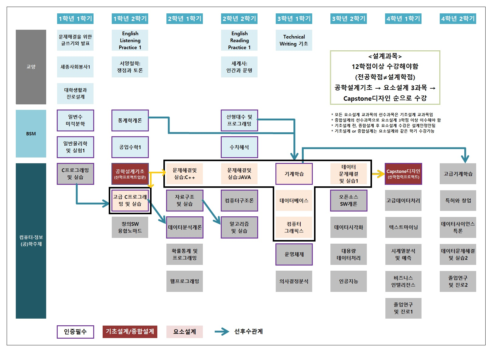

# 크롤링을 통한 csv 생성 자동화 [python3]

# 공학인증 테이블

## 의존성
* 실행할 때 필요한 의존성

| 패키지         | 설치 명령어                         |
|----------------|-------------------------------------|
| `requests`     | `pip install requests`              |
| `beautifulsoup4`| `pip install beautifulsoup4`        |
| `lxml`         | `pip install lxml`                  |
| `selenium`     | `pip install selenium`              |
| `webdriver_manager` | `pip install webdriver_manager` |


## 테이블 형식
### Case1

### Case2


## 파일 설명
### case1_crawl.py
* url을 입력하여 해당 테이블의 데이터를 공학 로직에 맞는 csv 형태로 변형하는 csv
* 완전한 자동화 csv 생성 실행 파일
* 실행 예시 (터미널에서 실행)
    ```
    \row_data> & C:/Users/q5749/AppData/Local/Programs/Python/Python312/python.exe case1_crawl.py
    Enter the URL: https://abeek.sejong.ac.kr/abeek/program0302_6.html
    ```
### case2_crawl.py
* url을 입력하여 해당 테이블의 데이터를 공학 로직에 맞는 csv 형태로 변형하는 csv
* 해당로직은 한번에 csv 변형이 어려워 json 형식으로 추출 한 뒤, csv로 다시 변형
  * 이때 courses_case2.csv파일이 필요함
* output_case2.json과 csv가 저장됨

### course_requirements_normalized_~~.csv
* 결과 csv 파일

### courses_case2.csv

* 위 사진과 같은 이수 체계도에 따른 전문교양/BSM/전공으로 나눈 csv파일


# 강의계획서

(미완)